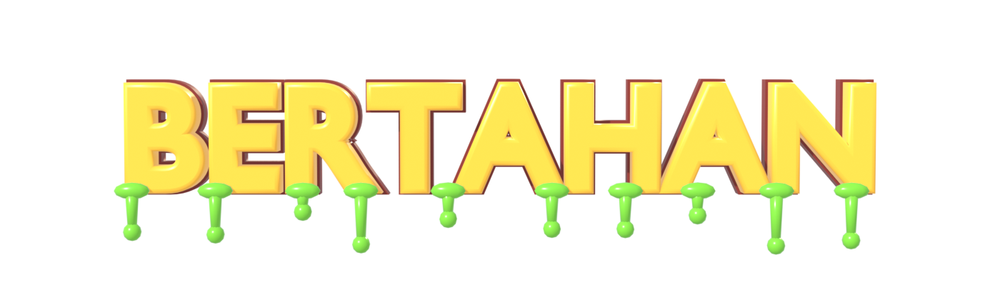
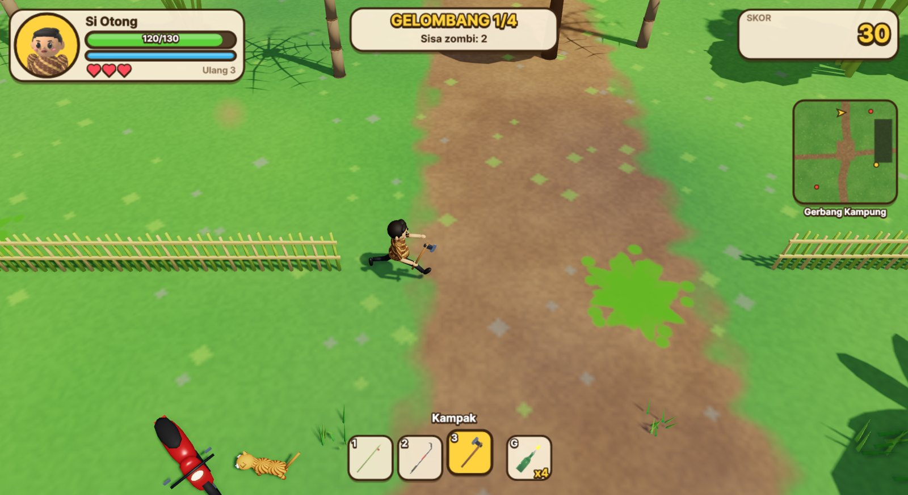
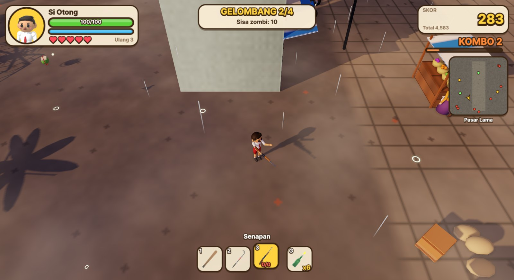
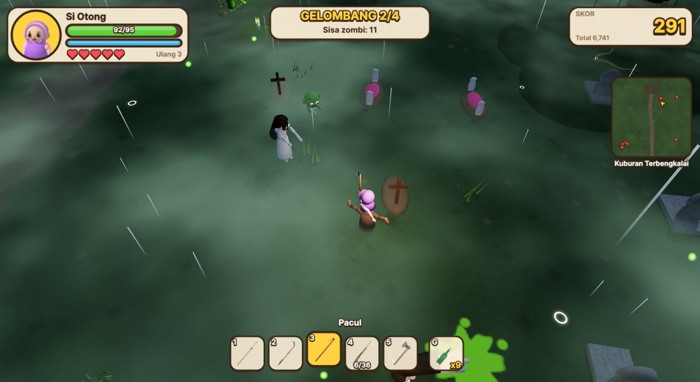

# BERTAHAN!



**Bertahan** adalah game 3D *survival* orang ketiga melawan zombi di sebuah perkampungan Indonesia. Pilih salah satu anggota keluarga pemberani (Bapak, Ibu, Kakak, Ade, Kake, atau Nene), lalu pertahankan Kampung Damai dari gelombang zombi yang lucu tapi berbahaya. Senjatanya pun serba ada: pentungan, sapu lidi, wajan, bambu runcing, linggis, kampak, pacul, senapan tua, sampai bom molotov.

> Dibuat oleh **Ariana Mischa Fadhila** dari **Subadubin Studios**.


## Fitur

- **Cerita pembuka sinematik** yang dirender langsung di mesin game. Kampung Damai yang tenang, ritual dukun di kuburan tua, zombi bangkit dari tanah, warga berlarian, lalu satu keluarga yang memilih bertahan.
- **Menu dengan latar 3D yang hidup.** Warga menyapu, mencangkul sawah, mengobrol di pos ronda, dan anak-anak bermain. Sesekali zombi lewat dan membuat warga lari tunggang langgang.
- **Alur New Game:** Input Nama (bawaan *Si Otong*), lalu Tingkat Kesulitan (**Bayi**, **Pemberani**, **Mimpi Buruk**), lalu Pilih Karakter, lalu Mulai.
- **4 level** dengan suasana berbeda: Gerbang Kampung (siang), Sawah Berhantu (malam), Pasar Lama (sore, gerimis), dan Kuburan Terbengkalai (malam, hujan dan petir). **Level 5 sampai 10 segera hadir.**
- **Nyawa dan kesempatan ulang.** Setiap level diberi beberapa nyawa. Jika nyawa habis, level diulang, maksimal 3 kali. Jika kesempatan juga habis, petualangan dimulai lagi dari Level 1.
- **Top Skor per level** berisi nama pemain, karakter, tingkat kesulitan, dan tanggal.
- **Pertarungan yang seru:** kombo pengali skor, *hit-stop*, guncangan kamera, angka damage, bom molotov yang membakar area, bos dengan serangan khusus, dan tujuh jenis zombi.
- **Lingkungan yang hidup:**
  - Skybox bertekstur (matahari, bulan, bintang, siluet gunung).
  - Awan yang bergerak beserta bayangannya di tanah.
  - Kabut misteri di sawah dan kuburan.
  - Hujan dengan cipratan air, petir, dan kunang-kunang.
  - Pohon, bambu, semak, rumput, dan padi yang bergoyang tertiup angin.
- **Musik dan efek suara** yang disintesis secara prosedural, termasuk suara 3D posisional.
- **Menu Pilihan:** volume musik dan efek, kualitas grafik (Rendah, Sedang, Tinggi), layar penuh, getaran layar, FPS, pilihan GPU (DX12/Vulkan), dan kecepatan putar kamera.
- **Menu Tentang** berisi kredit yang bergulir.

| | |
|---|---|
|  |  |
|  |  |

## Menjalankan game

Kebutuhan:
- .NET 10 SDK
- Windows, Linux, atau macOS
- GPU dengan dukungan DirectX 12, Vulkan, atau Metal

```bash
dotnet run --project src/Bertahan
```

Saat pertama kali dijalankan, cerita pembuka akan diputar otomatis. Cerita ini bisa diputar lagi dari menu **CERITA**.

### Kontrol

| Tombol | Aksi |
|---|---|
| W A S D / Panah | Bergerak |
| Mouse | Membidik |
| Klik kiri / J | Menyerang / menembak |
| Klik kanan / G | Lempar bom molotov |
| Spasi | Berguling (kebal sesaat) |
| Shift | Berlari |
| R | Isi ulang senapan |
| 1 - 9 / roda mouse | Ganti senjata |
| Q / E | Putar kamera |
| + / - | Dekatkan / jauhkan kamera |
| Esc / P | Istirahat (pause) |
| F11 | Layar penuh |
| F12 | Simpan screenshot ke `Pictures/Bertahan` |

## Dokumentasi

Dokumentasi lengkap ada di folder [`docs/`](docs/README.md):

- [Cara bermain](docs/cara-bermain.md): karakter, senjata, zombi, level, skor, nyawa
- [Menu dan antarmuka](docs/menu-dan-antarmuka.md): semua layar beserta screenshot
- [Lingkungan dan atmosfer](docs/lingkungan.md): langit, awan, kabut, hujan, angin
- [Arsitektur kode](docs/arsitektur.md): struktur program dan alur data
- [Pipeline aset](docs/aset.md): model dan animasi Blender (MCP), audio prosedural
- [Panduan pengembangan](docs/pengembangan.md): build, mode screenshot, catatan teknis

## Teknologi

- [.NET 10](https://dotnet.microsoft.com/) dan [Avalonia UI 12](https://avaloniaui.net/) untuk aplikasi, menu, dan HUD
- [Three.Net](https://github.com/DotNetVibeCoderz/Vibe_Graphics/tree/main/ThreeNet) sebagai mesin 3D (wgpu: DirectX 12, Vulkan, Metal)
- [Blender](https://www.blender.org/) melalui [Blender MCP](https://www.blender.org/lab/mcp-server/) untuk semua model, rig, dan animasi (skrip di `blender/`)
- Audio disintesis dengan kode C# (`tools/AudioGen`)

## Struktur repositori

```
art/                 Gambar referensi (konsep gameplay, level, karakter, bos)
blender/             Skrip Python Blender: model, rig, animasi, render ikon UI
src/Bertahan/        Game (.NET 10 + Avalonia + Three.Net)
  Core/              Pengaturan, audio, input, grafik, screenshot
  Game/              Logika game: sesi level, pemain, zombi, gelombang, atmosfer, desa menu
  UI/                Layar menu, HUD, tema
  Assets/            Model GLB, audio WAV, gambar UI (hasil generate)
tools/AudioGen/      Generator musik dan efek suara prosedural
docs/                Dokumentasi dan screenshot
```

## Kredit

**Dibuat oleh Ariana Mischa Fadhila dari Subadubin Studios.**

Mesin 3D: Three.Net oleh Gravicode Studios. Aset 3D dibuat dengan Blender.
