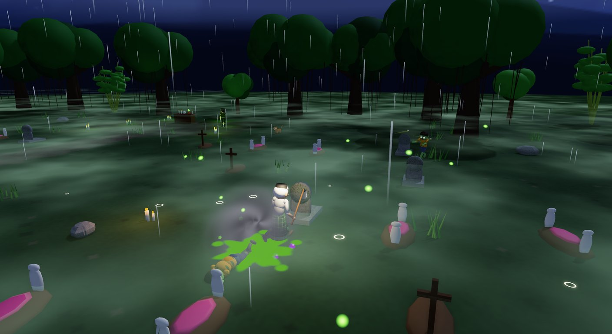

# Dokumentasi Bertahan

Selamat datang di dokumentasi **Bertahan**, game 3D survival zombi di perkampungan Indonesia.

| Dokumen | Isi |
|---|---|
| [Cara bermain](cara-bermain.md) | Tujuan, kontrol, keluarga pahlawan, senjata, zombi, level, tingkat kesulitan, skor, nyawa dan kesempatan ulang |
| [Menu dan antarmuka](menu-dan-antarmuka.md) | Cerita pembuka, menu utama, alur New Game, peta, HUD, pause, hasil level, Top Skor, Pilihan, Tentang |
| [Lingkungan dan atmosfer](lingkungan.md) | Skybox, awan bergerak, bayangan awan, kabut, hujan, petir, kunang-kunang, angin |
| [Arsitektur kode](arsitektur.md) | Struktur proyek, alur shell, siklus frame, sistem gameplay |
| [Pipeline aset](aset.md) | Model, rig, dan animasi Blender (MCP), ikon UI, audio prosedural, aturan penamaan |
| [Panduan pengembangan](pengembangan.md) | Build, mode screenshot/autoplay, pengaturan, catatan teknis Three.Net |

## Sekilas

- **Genre:** survival aksi orang ketiga, bergaya lucu dan menarik
- **Platform:** Windows, Linux, macOS (.NET 10, GPU DirectX 12, Vulkan, atau Metal)
- **Pemain:** 1
- **Bahasa:** Indonesia
- **Dibuat oleh:** Ariana Mischa Fadhila dari Subadubin Studios

## Galeri

| | |
|---|---|
|  |  |
|  |  |
|  |  |

Gambar konsep asli yang menjadi referensi aset ada di folder [`art/`](../art).
