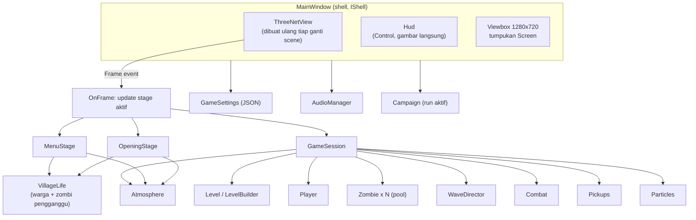
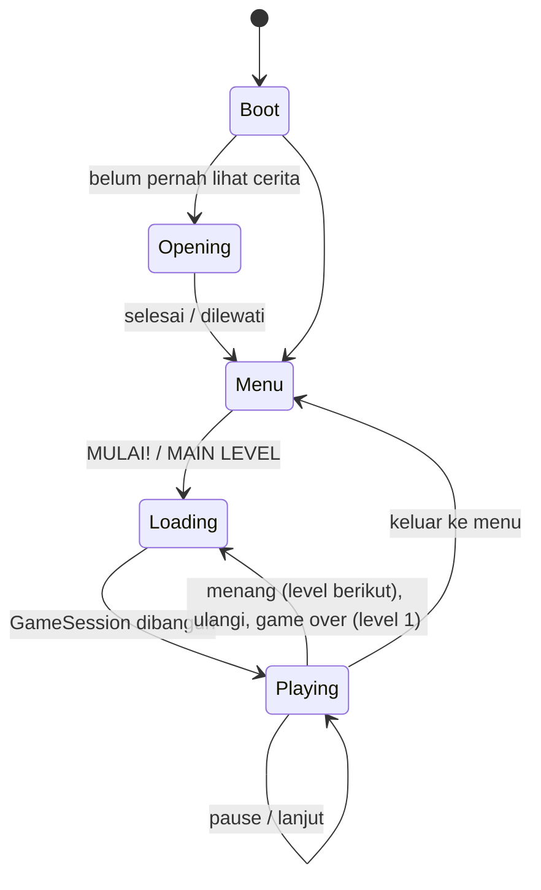

# Arsitektur Kode

[Kembali ke indeks](README.md)

Bertahan adalah aplikasi Avalonia (.NET 10) dengan **satu jendela**: tampilan 3D Three.Net di lapisan bawah, HUD yang digambar langsung di atasnya, dan tumpukan layar UI di lapisan paling atas.

## Struktur folder `src/Bertahan`

| Folder / file | Isi |
|---|---|
| `MainWindow.axaml(.cs)` | Shell game: mode (Boot, Opening, Menu, Loading, Playing), navigasi layar, alur level, input, pengaturan, screenshot, dan mode screenshot otomatis |
| `Core/GameSettings.cs` | Pengaturan, Top Skor per level, dan petualangan tersimpan (JSON source-generated) |
| `Core/AudioManager.cs` | Mesin audio Three.Net: musik dengan crossfade, efek 3D posisional, suara berulang (api) |
| `Core/InputMap.cs` | Keyboard dan mouse, termasuk tombol yang baru ditekan pada frame ini, lalu diubah menjadi `InputState` |
| `Core/Graphics.cs` | Pemetaan Rendah/Sedang/Tinggi ke `RendererOptions` |
| `Core/GpuBackend.cs` | Memilih DX12 atau Vulkan dengan uji render (lihat [pengembangan](pengembangan.md)) |
| `Core/Screenshot.cs` | Menggabungkan frame 3D dengan lapisan UI menjadi PNG |
| `Game/Defs.cs` | Tabel data: senjata, karakter, zombi, level dan gelombang |
| `Game/Difficulty.cs` | Bayi, Pemberani, Mimpi Buruk |
| `Game/Campaign.cs` | Petualangan: nama, karakter, level, skor total, kesempatan mengulang |
| `Game/GameSession.cs` | Satu permainan level: scene, aktor, aturan, nyawa, skor, cutaway |
| `Game/Player.cs`, `Zombie.cs`, `Combat.cs`, `Pickups.cs`, `WaveDirector.cs` | Sistem gameplay |
| `Game/Level.cs` | `LevelBuilder`: menyusun 4 level dari prop Blender, lalu mendaftarkan rintangan, penghalang pandangan, dan tanaman |
| `Game/Navigation.cs` | Tabrakan 2D (kotak dan lingkaran) serta flow field menuju pemain |
| `Game/Models.cs` | `PropLibrary` (prototipe GLB + clone) dan `AnimatedModel` (blending klip dengan bobot) |
| `Game/Atmosphere.cs` | Langit, awan, kabut, hujan, petir, kunang-kunang, angin |
| `Game/Village.cs` | `VillageLife`: desa hidup untuk menu dan cerita |
| `Game/MenuStage.cs`, `OpeningStage.cs` | Latar menu dan cerita pembuka |
| `Game/Autopilot.cs` | Bot pemain untuk screenshot dan uji otomatis |
| `UI/*` | Tema (`Kit`), tombol (`MenuButton`), teks bergaris (`OutlinedText`), semua `Screen`, dan `Hud` |

## Alur shell

- **Screen** adalah halaman UI berukuran desain 1280x720 yang diskalakan dengan `Viewbox`. `IShell.Show/Replace/Back` mengatur tumpukan layar. Setiap layar bisa menentukan tampilan latar menu (`StageView`: desa atau keluarga).
- **LoadingScreen** ditampilkan beberapa frame lebih dulu. Setelah itu `GameSession` dibangun di thread UI.
- **Hasil level** (`LevelFinished`) mencatat Top Skor dengan nama pemain, memperbarui `Campaign` (`LevelWon`/`LevelLost`), dan menyimpan `SavedRun`.

## Siklus frame (`OnFrame`)

1. `dt` dibatasi maksimal 0,05 detik.
2. Stage aktif diperbarui:
   - `OpeningStage.Update`, atau
   - `MenuStage.Update`, atau
   - `GameSession.Update(dt, input)`, dengan `input` dari `InputMap.Build` atau `Autopilot`.
3. Di dalam `GameSession.Update`:
   - hit-stop, banner, dan kombo;
   - kamera;
   - `Player`;
   - nyawa dan bangkit lagi;
   - flow field (tiap 0,25 detik);
   - `Zombie`, `Combat`, `Pickups`, dan `WaveDirector`;
   - `Scene.UpdateAnimations`;
   - kamera mengikuti pemain;
   - cutaway rumah dan pohon;
   - `Atmosphere`, `Particles`, dan listener audio.
4. Layar teratas mendapat `Tick(dt)` untuk animasi UI, lalu HUD digambar ulang.

## Sistem gameplay

- **AnimatedModel** memainkan semua klip sekaligus dengan bobot. Klip dasar (idle, walk, run, spawn, dodge, die, cheer) di-crossfade, sedangkan aksi (swing, thrust, shoot, throw, hit, attack, cast) dilapiskan di atasnya. Senjata adalah node `W_<id>` di tangan model yang ditampilkan atau disembunyikan.
- **Zombie** memakai pool per jenis dengan state `Spawning`, `Chasing`, `Charging`, `Dying`, dan `Inactive`. Setiap jenis punya perilaku khusus (lihat [cara bermain](cara-bermain.md)).
- **Navigation:** zombi mengikuti flow field di sekitar bangunan dan berjalan lurus bila jalur ke pemain bebas.
- **Combat:**
  - serangan jarak dekat berupa busur di depan pemain;
  - tembakan hitscan yang bisa menembus;
  - proyektil molotov berparabola dan zona api;
  - bola api Dukun;
  - hentakan tanah Genderuwo.
- **Cutaway:** rumah dan pohon tinggi (`Level.Occluders`) yang berada di antara kamera dan pemain disembunyikan sementara.
- **Nyawa:** saat pemain pingsan dan masih punya nyawa, `GameSession.Respawn` membangkitkannya lagi.

## Data dan penyimpanan

`GameSettings` disimpan di `%APPDATA%/Bertahan/settings.json`. Lokasi ini bisa diganti dengan variabel lingkungan `BERTAHAN_SETTINGS`. Isinya:
- volume, kualitas grafik, layar penuh, getaran, FPS, kecepatan kamera;
- backend GPU dan hasil uji backend;
- nama, karakter, dan kesulitan terakhir, serta status cerita pembuka;
- `TopScores`: daftar 10 skor terbaik per id level (`gerbang`, `sawah`, `pasar`, `kuburan`);
- `SavedRun`: `Campaign` yang sedang berjalan.
