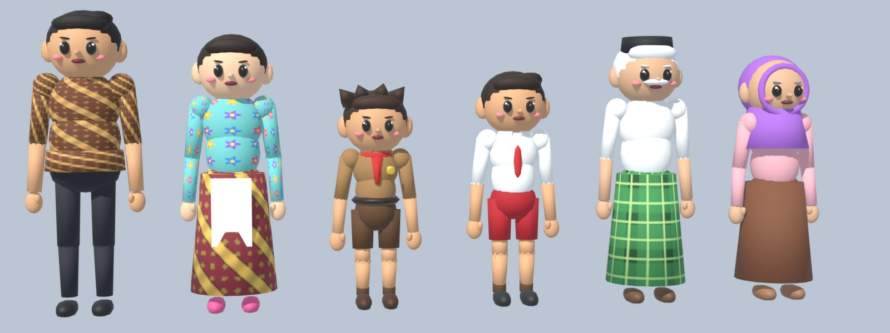
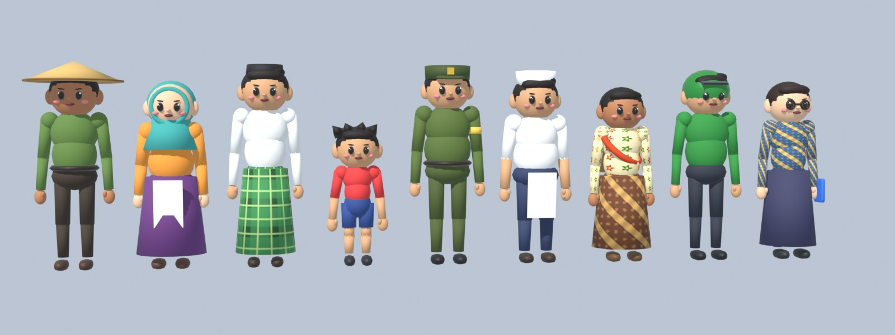
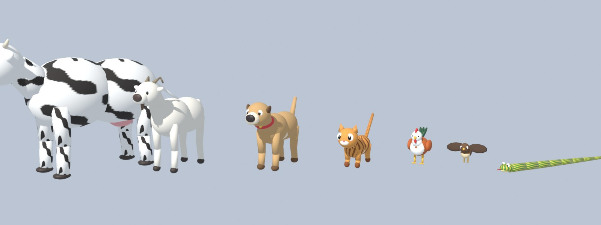

# Pipeline Aset

[Kembali ke indeks](README.md)

**Semua aset game dibuat dengan kode.** Model, rig, dan animasi dibuat dengan skrip Python Blender (dijalankan melalui Blender MCP atau Blender headless). Musik dan efek suara disintesis dengan C#. File di `src/Bertahan/Assets/` adalah **hasil generate**: ubah skripnya, lalu generate ulang.

Gambar konsep di [`art/`](../art) (gameplay, level 1-4, karakter pemain, musuh, dan bos) adalah referensi visual untuk aset-aset ini.

## Model 3D (Blender)

| Skrip | Isi |
|---|---|
| `blender/btk.py` | Toolkit bersama: primitif, material, tekstur prosedural, armature humanoid, skinning, export GLB, preview |
| `blender/characters.py` | Keluarga: Bapak, Ibu, Kakak, Ade, Kake, Nene (gaya chibi, kain batik/kebaya/sarung prosedural) |
| `blender/villagers.py` | Warga NPC: petani (caping), pedagang (bakul sayur), pak ustad (peci, sarung), bocah, hansip (seragam hijau, topi, ban lengan, peluit), tukang bakso (topi koki, celemek), mbok jamu (kebaya, jarik, bakul botol jamu), tukang ojek (jaket dan helm hijau), bu guru (batik, kacamata, buku) |
| `blender/animals.py` | Hewan: ayam, sapi, kambing, kucing, anjing (rig kaki empat umum), ular (rig rantai 9 segmen), burung (rig sayap). Klip: `idle`, `walk`, `run` (burung: terbang, ular: melata cepat), `die`, `attack` (mematuk, merumput, menggonggong, mematuk ular) |
| `blender/zombies.py` | Warga, Tuyul, Pocong, Satpam, Kuntilanak, Genderuwo, Dukun |
| `blender/weapons.py` | 9 senjata dan barang pungutan |
| `blender/props.py` | Rumah, ruko, kios, masjid, gapura, pohon, sawah, nisan, dan lainnya (51 prop) |
| `blender/anims.py`, `blender/zanims.py` | Klip animasi keluarga/warga dan zombi |
| `blender/ui_renders.py` | Render potret, ikon zombi dan senjata, serta logo ke `Assets/UI` |
| `blender/build_all.py` | Generate ulang semua model |

Menjalankan secara headless:

```bash
blender -b --python blender/build_all.py
```

Atau lewat Blender MCP (server `blender` di `.mcp.json`; di Blender 5.2 add-on **Blender MCP** harus aktif dan server-nya dijalankan di `localhost:9876`). Jalankan skrip yang sama dengan tool `execute_blender_code`:

```python
import sys, importlib
sys.path.insert(0, r"D:\Syubadubin\bertahan\blender")
import btk, animals
importlib.reload(btk); importlib.reload(animals)
animals.build("ayam")          # atau villagers.build("hansip"), characters.build_all(), ...
```

Satu kelompok bisa dibangun ulang sendiri, misalnya `villagers.build("petani")` atau `main(groups=("props",))`. Semua model, rig, dan animasi baru (hewan dan warga) serta penyesuaian proporsi dibuat lewat MCP seperti ini.

### Proporsi mengikuti art

Model keluarga, warga, dan zombi disesuaikan dengan [`art/players.png`](../art/players.png) dan [`art/enemies.png`](../art/enemies.png):
- Gayanya kartun, tapi tidak chibi. Kepala orang dewasa kira-kira seperlima tinggi badan, dengan kaki dan lengan lebih panjang.
- Detail tambahan: ibu jari, kerah kemeja, ujung baju batik Bapak yang tidak dimasukkan, rambut belah samping, hijab Nene yang membingkai wajah, dan celemek Ibu yang membulat.
- Tuyul tetap berkepala besar seperti di art, dan Genderuwo dibuat lebih kekar.

| Keluarga | Warga | Hewan |
|---|---|---|
|  |  |  |

Konvensi Blender: sumbu Z ke atas, karakter menghadap -Y, sisi kiri karakter +X (tulang berakhiran `_L`/`_R`). Exporter glTF mengubahnya menjadi Y ke atas dan menghadap +Z, sesuai kebutuhan game.

### Aturan penamaan (dicocokkan sebagai string oleh game)

- File: `char_<id>.glb`, `npc_<id>.glb`, `animal_<id>.glb`, `zombie_<id>.glb`, `weapon_<id>.glb`, `prop_<nama>.glb`. Id warga dan hewan terdaftar di `CritterDef.All` (`Game/Fauna.cs`). `id` harus sama dengan `Id` di `Game/Defs.cs`.
- Model karakter membawa **semua** mesh senjata sebagai node `W_<idSenjata>` di tangan kanan. Game menampilkan satu senjata saja.
- Nama klip:
  - dasar: `idle, walk, run, spawn, dodge, die, cheer`
  - aksi: `aim, swing, thrust, attack, cast, throw, shoot, hit`
- Prop tanaman dikenali dari awalan namanya (`prop_rumput`, `prop_padi`, `prop_semak`, `prop_pohon_*`, `prop_rumpun_bambu`, dan lainnya) untuk efek angin di `Atmosphere.Plants`.

## Gambar UI

- `Assets/UI/portrait_*`, `card_*`, `zombie_*`, `weapon_*`, dan `logo` dirender dari Blender (`ui_renders.py`).
- `Assets/UI/scene_level_N.png` adalah **render dari mesin game** untuk layar loading dan peta. Buat ulang dengan mode screenshot:

```bash
Bertahan.exe --shot level1.png --scene level --level 1 --warp 44 --autoplay --overlay preview
```

Lalu kecilkan ke 1408x770 dan simpan sebagai `scene_level_1.png`.
- `Assets/UI/level_N.png` dan `loading.png` adalah seni konsep (tidak dipakai lagi oleh loading/peta, kecuali `loading.png` sebagai layar boot).

## Audio prosedural

`tools/AudioGen` mensintesis semua musik dan efek suara menjadi WAV di `Assets/Audio`:

```bash
dotnet run --project tools/AudioGen
```

| File | Isi |
|---|---|
| `Dsp.cs`, `Instruments.cs` | Osilator, envelope, filter, reverb; instrumen gamelan dan kampung: saron, bonang, gong, kendang, suling, kentongan, shaker, bass, pad |
| `Music.cs` | `music_menu`, `music_day`, `music_night`, `music_boss`, `jingle_victory`, `jingle_defeat` |
| `Sfx.cs` | Ayunan, pukulan (tumpul, tajam, wajan "BONG"), tembakan, kaca pecah, api, ledakan, erangan zombi, tawa kuntilanak, cekikik tuyul, lompatan pocong, raungan, bola api, suara pemain, UI; suara hewan (`sfx_ayam` petok, `sfx_jago` kukuruyuk, `sfx_sapi`, `sfx_kambing`, `sfx_kucing`, `sfx_anjing`, `sfx_burung`, `sfx_ular` desis) dan teriakan warga (`sfx_teriak_pria`, `sfx_teriak_wanita`) |

Id audio adalah nama file tanpa `.wav`. `AudioManager` memuat semua file di folder tersebut, dan `LevelDef.Music` merujuk musik berdasarkan id.
