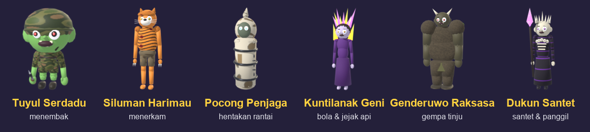
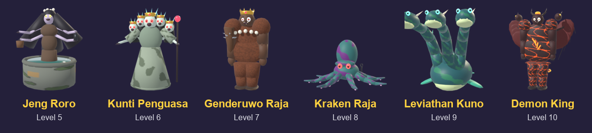
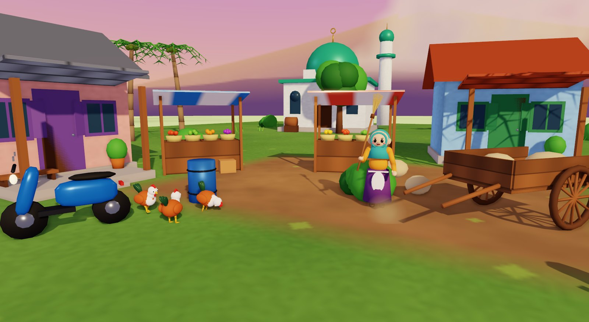
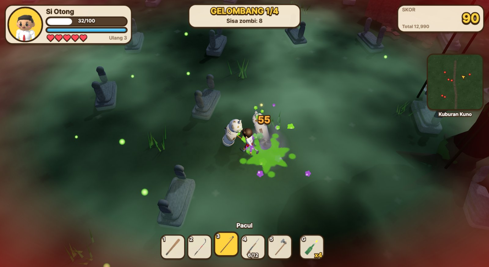
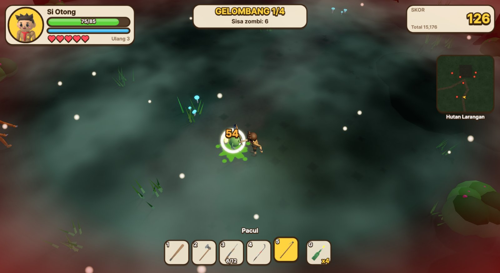
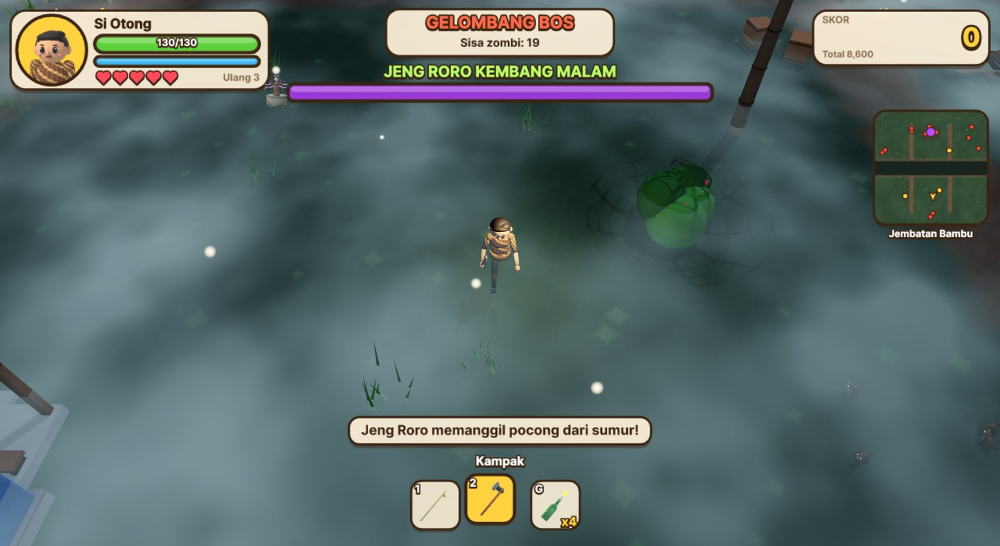
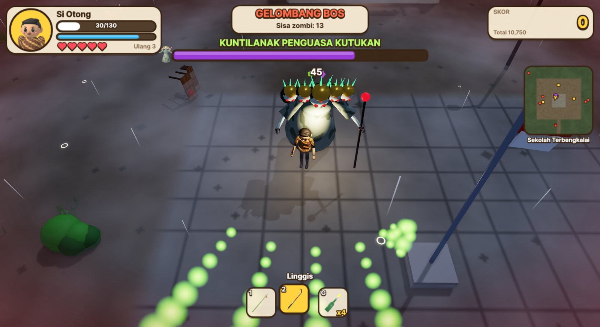
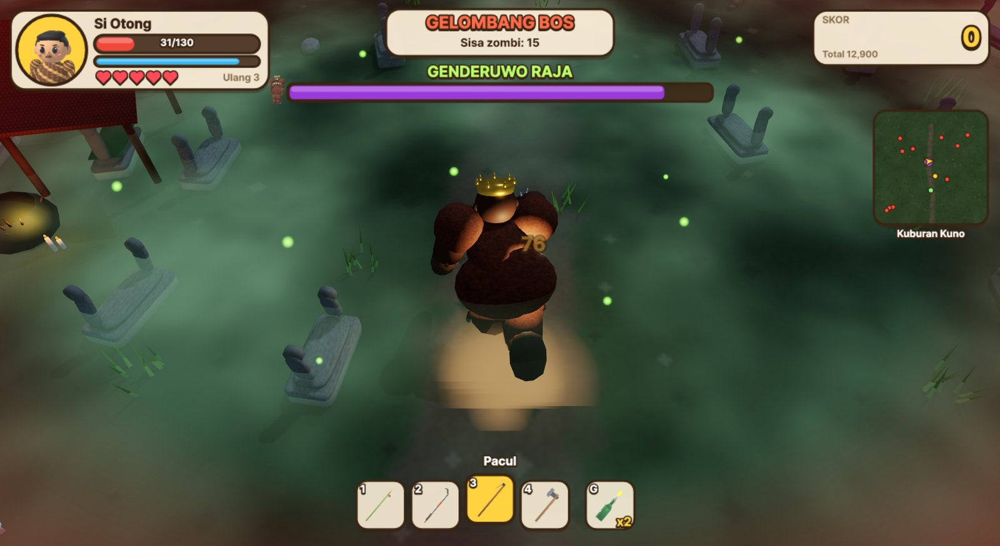
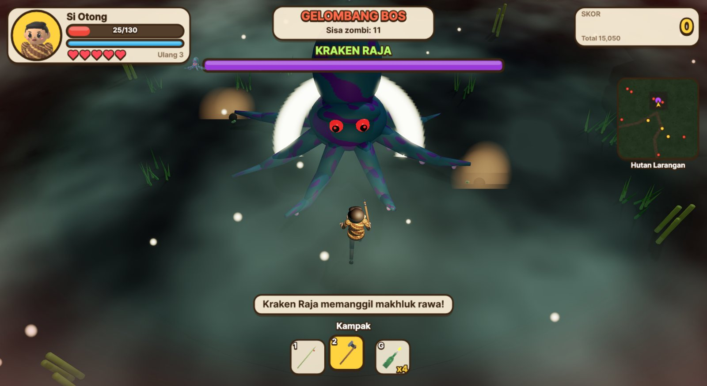

# Cara Bermain

[Kembali ke indeks](README.md)

Wabah zombi datang dari kuburan tua dan menyerang kampung demi kampung. Tugasmu adalah bertahan melewati setiap **gelombang** zombi di tiap level, mengalahkan **bos** di gelombang terakhir, lalu membawa keluargamu ke level berikutnya.

## Kontrol

| Tombol | Aksi |
|---|---|
| W A S D / Panah | Bergerak (relatif terhadap kamera) |
| Mouse | Membidik; pemain menghadap ke kursor |
| Klik kiri (tahan) / J | Menyerang; menembak saat memegang senapan |
| Klik kanan / G / L | Lempar bom molotov ke arah bidikan |
| Spasi / K | Berguling: kebal sekitar 0,45 detik, menghabiskan 20 tenaga |
| Shift (tahan) | Berlari: lebih cepat 45%, menghabiskan tenaga |
| R | Isi ulang senapan (otomatis juga saat peluru habis) |
| 1 - 9 / roda mouse | Ganti senjata di tas |
| Q / E | Putar kamera |
| + / - | Dekatkan / jauhkan kamera |
| Esc / P | Istirahat (pause) |

Game juga otomatis masuk mode istirahat ketika jendela kehilangan fokus.

## Keluarga pahlawan

| Karakter | Peran | Darah | Kecepatan | Pukulan | Kegesitan | Senjata awal | Keistimewaan |
|---|---|---|---|---|---|---|---|
| **Bapak** | Kepala keluarga | 130 | 5,0 | x1,2 | x1,0 | Bambu Runcing | Darah paling tebal, tusukan jarak jauh |
| **Ibu** | Jagoan dapur | 115 | 5,2 | x1,1 | x1,05 | Wajan | Wajan membuat zombi pusing |
| **Kakak** | Anak SD pemberani | 100 | 5,7 | x1,0 | x1,15 | Pentungan | Lincah, serangan cepat |
| **Ade** | Anggota Pramuka | 85 | 6,3 | x0,9 | x1,3 | Pentungan | Paling gesit, gulingan lebih jauh |
| **Kake** | Mantan jawara kampung | 100 | 4,6 | x1,4 | x0,9 | Pentungan | Pukulan jurus silat paling sakit |
| **Nene** | Ratu sapu lidi | 95 | 4,7 | x1,0 | x1,0 | Sapu Lidi | Jamu rahasia: darah pulih 2 per detik |

## Senjata

Senjata tambahan tergeletak di peta dan bisa dipungut dengan berjalan di atasnya. Semua senjata yang dipungut masuk ke tas, dan kamu bisa berganti senjata dengan tombol 1-9.

| Senjata | Jenis | Damage | Jangkauan | Jeda | Catatan |
|---|---|---|---|---|---|
| Pentungan | Ayun | 22 | 1,7 m | 0,42 s | Kayu keras andalan ronda malam |
| Sapu Lidi | Ayun | 14 | 2,1 m | 0,34 s | Busur ayunan paling lebar (150°), dorongan kuat |
| Wajan | Ayun | 28 | 1,6 m | 0,55 s | Membuat zombi pusing (stun 0,9 s) |
| Bambu Runcing | Tusuk | 32 | 2,8 m | 0,58 s | Menembus hingga 3 zombi dalam satu garis |
| Linggis | Ayun | 36 | 1,9 m | 0,60 s | Berat dan tangguh |
| Kampak | Ayun | 48 | 1,8 m | 0,75 s | Tebasan keras |
| Pacul | Ayun | 60 | 2,1 m | 0,95 s | Paling mematikan, dorongan terbesar |
| Senapan | Tembak | 65 | 30 m | 0,55 s | Magasin 6, menembus 2 zombi, isi ulang 1,6 s |
| Bom Molotov | Lempar | 35 + api | area ~3,4 m | - | Api membakar 6 detik (9 damage tiap 1/3 detik) |

Damage akhir dikalikan dengan **Pukulan** karakter. Kecepatan serangan dipengaruhi **Kegesitan**. Serangan berat memberi efek *hit-stop* dan guncangan kamera.

## Barang pungutan

| Barang | Efek |
|---|---|
| Nasi bungkus | +35 darah |
| Jamu | +70 darah |
| Peti peluru | +12 peluru senapan |
| Botol molotov | +2 bom molotov |
| Senjata | Masuk ke tas; peluru +12 bila senapan sudah dimiliki |

Setiap kali gelombang selesai, perbekalan baru muncul di peta. Zombi yang kalah juga kadang menjatuhkan nasi, peluru, atau molotov. Pemain memulai level dengan 2 molotov dan 12 peluru cadangan.

## Para zombi

| Zombi | Darah | Jalan / lari | Damage | Skor | Perilaku |
|---|---|---|---|---|---|
| Zombi Warga | 55 | 1,3 / 2,4 | 10 | 10 | Zombi dasar yang mengejar lewat jalan kampung |
| Tuyul Zombi | 32 | 3,2 / 4,6 | 6 | 15 | Sangat cepat dan bergerak zig-zag |
| Pocong Zombi | 75 | 1,9 / 2,9 | 12 | 20 | Hanya bergerak saat melompat; tidak terhambat air sawah |
| Satpam Zombi | 160 | 1,4 / 2,3 | 18 | 40 | Tebal dan memukul keras |
| Kuntilanak Zombi | 110 | 2,0 / 3,2 | 12 | 50 | Jeritannya memperlambat pemain 2,5 detik |
| Genderuwo Zombi (bos) | 480 | 1,7 / 3,4 | 28 | 150 | Menyeruduk (30 damage) dan hentakan tanah; pusing bila menabrak tembok |
| Dukun Zombi (bos akhir) | 1500 | 1,4 / 2,0 | 20 | 600 | Menjaga jarak, menembakkan bola api (5 bola saat darah < 50%), memanggil anak buah tiap 14 detik |

### Musuh tambahan (Zona Terlarang)

| Zombi | Darah | Jalan / lari | Damage | Skor | Perilaku |
|---|---|---|---|---|---|
| Tuyul Serdadu | 60 | 3,0 / 4,2 | 8 | 30 | Cepat, berhenti untuk menembak dari jauh |
| Siluman Harimau | 220 | 2,2 / 4,4 | 18 | 80 | Merunduk lalu menerkam dari jarak 3,5 - 10 m |
| Pocong Penjaga | 320 | 1,8 / 2,7 | 20 | 100 | Melompat; setiap mendarat menimbulkan hentakan kecil |
| Kuntilanak Geni | 260 | 2,0 / 3,4 | 16 | 120 | Melayang, menembakkan 3 bola api dan meninggalkan jejak api |
| Genderuwo Raksasa | 900 | 1,6 / 3,2 | 34 | 250 | Menyeruduk dan pukulannya menimbulkan gempa |
| Dukun Santet | 900 | 1,3 / 1,9 | 22 | 400 | Menembakkan santet ungu dan memanggil pocong penjaga |

### Bos Zona Terlarang

| Level | Bos | Darah | Pola serangan |
|---|---|---|---|
| 5 | Jeng Roro Kembang Malam | 2000 | Berakar di sumur tua. Semburan bola air, tembang yang memperlambat, memanggil pocong |
| 6 | Kuntilanak Penguasa Kutukan | 2300 | Lima kepala: semburan 5 - 7 bola, jeritan ganda, memanggil kuntilanak |
| 7 | Genderuwo Raja | 2800 | Seruduk 42 damage, hantaman tanah bertanda lingkaran, memanggil pasukan |
| 8 | Kraken Raja | 3000 | Berakar di rawa. Tentakel menghantam lingkaran di sekitar pemain, semburan tinta, memanggil makhluk rawa |
| 9 | Leviathan Kuno | 3300 | Berakar di kolam. Tiga kepala menyembur 7 - 9 bola, hantaman besar, pusaran memuntahkan musuh |
| 10 | Demon King Abyss | 3600 | Semburan api yang membakar tanah, seruduk dan hantaman bergantian, membuka gerbang neraka |

- **Lingkaran di tanah** menandai hantaman yang akan datang. Segera keluar dari lingkaran.
- Saat darah bos di bawah 50%, bos **mengamuk** dan serangannya makin rapat.
- Bos yang **berakar** (Jeng Roro, Kraken, Leviathan) tidak mengejar, tapi hanya bisa dipukul dari tepi sumur, rawa, atau kolam.

Zombi makin kuat di level yang lebih tinggi: darah +10% (bos +5%), kecepatan +4%, dan damage +8% per level.

## Warga dan hewan

Kampung tidak hanya dihuni pahlawan dan zombi. Di setiap level ada warga dan hewan yang menjalani hari mereka:

| Level | Penghuni |
|---|---|
| Gerbang Kampung | Ayam, kambing, sapi, kucing, anjing, burung; petani, pedagang, hansip, bocah |
| Sawah Berhantu | Burung, ular, kambing, ayam, kucing; petani, pak ustad |
| Pasar Lama | Ayam, kucing, anjing, burung; pedagang, mbok jamu, tukang bakso, tukang ojek, bu guru |
| Kuburan Terbengkalai | Ular, kucing, burung, anjing; hansip |
| Jembatan Bambu | Burung, ayam, kucing, kambing; petani, tukang ojek |
| Sekolah Terbengkalai | Kucing, burung, anjing; bu guru, bocah |
| Kuburan Kuno | Ular, burung, kucing; pak ustad |
| Hutan Larangan | Ular, burung, kambing |
| Masjid Rusak | Kucing, anjing, ayam; pak ustad, hansip, pedagang |
| Candi Terlarang | Ular, burung |

- Mereka berkeliaran di sekitar rumahnya: ayam dan burung mematuk, sapi dan kambing merumput, kucing mengeong, anjing menggonggong.
- Begitu zombi mendekat, mereka **lari menjauh**. Burung **terbang** lalu hinggap lagi setelah aman. Anjing sempat menggonggong ke arah zombi sebelum kabur, dan warga berteriak sambil berlari.
- Zombi tidak menyerang mereka. Kamu tetap satu-satunya sasaran!

## Level

| Level | Nama | Zona | Waktu dan cuaca | Bos |
|---|---|---|---|---|
| 1 | Gerbang Kampung | Zona Aman | Siang cerah, berangin | Satpam Zombi (penutup gelombang terakhir) |
| 2 | Sawah Berhantu | Zona Bahaya | Malam berkabut, kunang-kunang | Genderuwo Zombi |
| 3 | Pasar Lama | Zona Menengah | Sore, gerimis | 2 Genderuwo Zombi |
| 4 | Kuburan Terbengkalai | Zona Berisiko | Malam, hujan, petir, kabut hijau | Dukun Zombi dan Genderuwo |
| 5 | Jembatan Bambu | Zona Bahaya | Malam, sungai berkabut; hanya dua jembatan untuk menyeberang | Jeng Roro Kembang Malam |
| 6 | Sekolah Terbengkalai | Zona Bahaya | Malam, gerimis; tiga ruang kelas tanpa atap | Kuntilanak Penguasa Kutukan |
| 7 | Kuburan Kuno | Zona Sangat Berisiko | Malam, kabut hijau, petir, pohon larangan | Genderuwo Raja dan Genderuwo Raksasa |
| 8 | Hutan Larangan | Zona Sangat Berisiko | Malam, kabut rawa, kunang-kunang | Kraken Raja |
| 9 | Masjid Rusak | Zona Terlarang | Kutukan: langit merah, pusaran hijau, rumah terbakar | Leviathan Kuno |
| 10 | Candi Terlarang | Zona Terlarang | Kutukan: candi, obor, altar ritual | Demon King Abyss |

| | |
|---|---|
|  |  |
|  |  |
|  |  |

Menamatkan Level 10 menutup cerita: pusaran kutukan lenyap dan Kampung Damai benar-benar damai.

Setiap level terdiri dari **4 gelombang**. Sebelum tiap gelombang ada hitungan mundur ("Kentongan berbunyi, zombi datang!"), dan setelah gelombang selesai ada jeda singkat untuk memungut perbekalan. Gelombang ke-4 adalah gelombang terakhir ("GELOMBANG BOS") dengan musik khusus. Setiap bos muncul dengan spanduk nama dan bilah darah sendiri di atas layar.

## Tingkat kesulitan

| | Bayi | Pemberani | Mimpi Buruk |
|---|---|---|---|
| Nyawa per level | 5 | 3 | 2 |
| Darah zombi | x0,7 | x1,0 | x1,35 |
| Damage zombi | x0,55 | x1,0 | x1,5 |
| Kecepatan zombi | x0,88 | x1,0 | x1,12 |
| Pengali skor | x0,75 | x1,0 | x1,5 |
| Peluang barang jatuh | x1,5 | x1,0 | x0,7 |

## Nyawa dan kesempatan ulang

- Setiap level dimulai dengan jumlah **nyawa** sesuai tingkat kesulitan (hati di HUD).
- Saat darah habis, pahlawan **pingsan**. Jika masih ada nyawa, ia bangkit di tempat yang sama dengan darah penuh, kebal selama 3 detik, dan zombi di sekitarnya terlempar menjauh.
- Jika **nyawa habis**, level gagal dan harus **diulang**. Setiap petualangan punya **3 kesempatan mengulang** per level ("Ulang 3" di HUD).
- Jika kesempatan mengulang juga habis, muncul **GAME OVER** dan petualangan **dimulai lagi dari Level 1** dengan skor total kembali nol.
- Menamatkan sebuah level mengembalikan kesempatan mengulang menjadi 3.
- Kemajuan petualangan tersimpan otomatis. Menu **LANJUTKAN** membuka Peta Petualangan di level terakhir.

## Skor

- **Mengalahkan zombi:** skor zombi x pengali kombo x pengali kesulitan.
- **Kombo:** setiap zombi yang kalah dalam 3 detik sejak yang sebelumnya menambah kombo. Pengalinya adalah 1 + (kombo / 5), maksimal x5.
- **Gelombang selesai:** bonus 100 x nomor gelombang.
- **Level selesai:** semua bonus berikut dikalikan pengali kesulitan.
  - Bonus waktu: 3000 - 5 per detik bermain.
  - Bonus darah: 5 x sisa darah.
  - Bonus nyawa: 250 per nyawa cadangan.
- **Bintang (1-3):** 1 bintang untuk menang, +1 bila tidak kehilangan nyawa, dan +1 bila darah di atas 50%.
- Skor level masuk ke **Top Skor** level tersebut (10 terbaik), termasuk percobaan yang gagal (ditandai "gugur").

## Tips

- Berguling membuatmu kebal sesaat. Gunakan untuk lolos dari seruduk Genderuwo.
- Lempar molotov ke kerumunan. Api terus membakar zombi yang melintas.
- Pocong hanya bergerak di udara. Pukul saat ia mendarat.
- Jauhi Kuntilanak saat ia mulai menjerit.
- Air sawah memperlambat semua orang, kecuali pocong dan kuntilanak.
- Dukun Zombi menjaga jarak. Kejar dia atau pakai senapan.
- Jembatan bambu adalah satu-satunya jalan menyeberangi sungai. Jangan sampai terkepung di tengahnya.
- Siluman Harimau merunduk sebelum menerkam. Berguling ke samping.
- Kuntilanak Geni meninggalkan jejak api. Jangan berdiri di atasnya.
