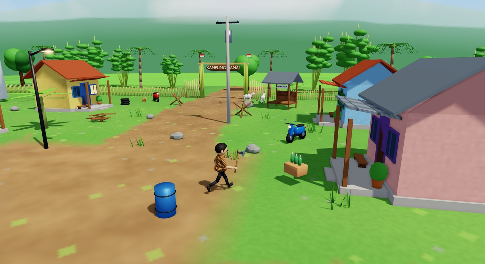
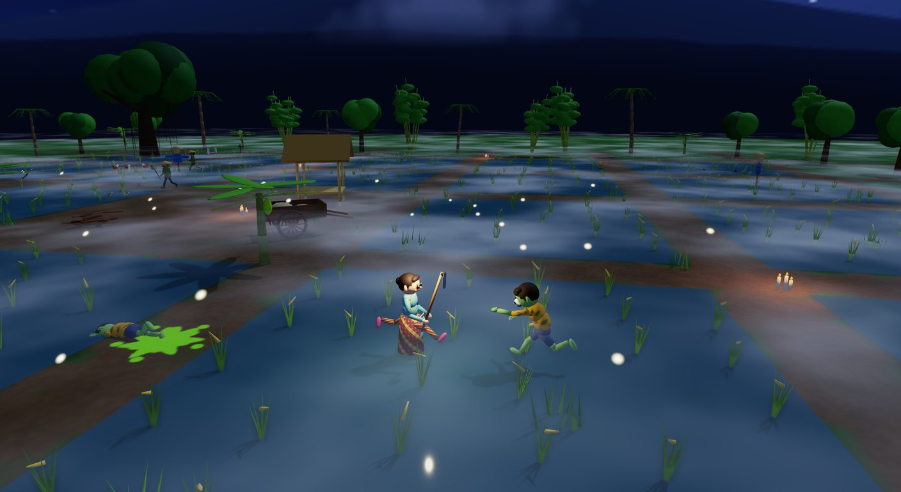
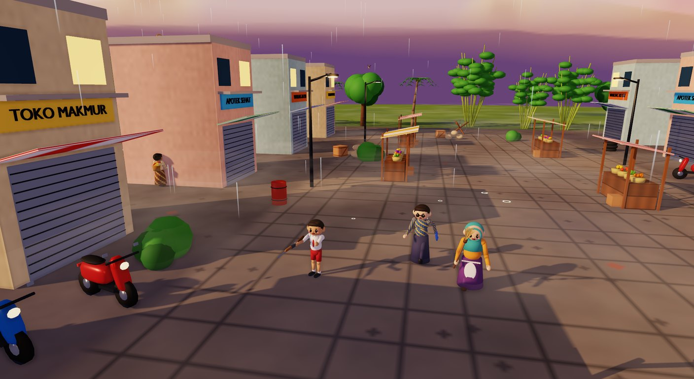

# Lingkungan dan Atmosfer

[Kembali ke indeks](README.md)

Setiap tempat di Bertahan punya langit, cuaca, dan angin sendiri. Semuanya diatur oleh kelas `Atmosphere` (`src/Bertahan/Game/Atmosphere.cs`) dengan gaya per level (`AtmosphereStyle.For(level)`).

| | |
|---|---|
|  **Gerbang Kampung:** siang cerah, awan dan bayangannya, debu tertiup angin |  **Sawah Berhantu:** malam berbintang, kabut tipis di atas sawah, kunang-kunang |
|  **Pasar Lama:** langit senja ungu-jingga, awan tebal, gerimis |  **Kuburan Terbengkalai:** hujan, petir, kabut hijau yang misterius, cahaya arwah hijau |

## Ringkasan per tempat

| Tempat | Langit | Awan | Angin | Kabut | Hujan | Lainnya |
|---|---|---|---|---|---|---|
| Menu dan cerita pembuka | Senja keemasan (malam di bagian cerita) | 45% | Sedang | - | - | Debu tertiup angin |
| Level 1 Gerbang Kampung | Siang | 50% + bayangan awan | Kencang | - | - | Debu tertiup angin |
| Level 2 Sawah Berhantu | Malam, bulan, bintang, Bima Sakti | 35% | Pelan | Tipis kebiruan | - | Kunang-kunang |
| Level 3 Pasar Lama | Senja | 70% + bayangan awan | Paling kencang | Sangat tipis | Gerimis | Cipratan air |
| Level 4 Kuburan Terbengkalai | Malam | 80% | Kencang | Tebal kehijauan | Hujan | Petir dan guntur, cahaya arwah hijau |

## Skybox

- Kubah langit berjari-jari 120 m yang **selalu mengikuti kamera**, sehingga langit terasa tak berujung.
- Teksturnya dilukis secara prosedural (`SkyPainter.Paint`):
  - gradasi zenit ke cakrawala;
  - cahaya dan cakram matahari atau bulan yang posisinya sama dengan arah cahaya matahari di level;
  - bintang dan pita Bima Sakti di malam hari;
  - siluet **gunung berapi dan perbukitan** di cakrawala dengan kabut udara, dan tepinya dihaluskan.
- Kabut eksponensial level diatur tipis agar langit tetap terlihat. Kabut linear bawaan Three.Net (10-100 m) dinonaktifkan dengan `FogStart`/`FogEnd` yang sangat jauh.

## Awan bergerak

- Lapisan awan berupa kubah transparan di dalam kubah langit. Teksturnya noise fBm yang bisa diulang (tileable), jadi awan bisa berputar pelan tanpa sambungan dan tampak **berarak melintasi langit**.
- Warna awan mengikuti waktu: putih kebiruan di siang hari, jingga keunguan di senja hari, dan biru gelap di malam hari.
- Karena kamera gameplay menghadap ke bawah, di level siang dan sore **bayangan awan** ikut bergerak di atas tanah mengikuti arah angin.

## Kabut misteri

Tiga lapis bidang kabut transparan di ketinggian 0,25 m, 0,9 m, dan 1,7 m. Tiap lapis memakai tekstur noise dengan skala berbeda dan bergeser ke arah berlawanan, sehingga kabut tampak **melayang dan bergulung pelan**. Warna dan ketebalannya diatur per level.

## Hujan dan petir

- **Hujan dianimasikan sepenuhnya di GPU** lewat *shader hook* GLSL (`user_vertex`) Three.Net. Ratusan garis hujan dalam kotak di sekitar pemain jatuh berdasarkan `time`, dengan tinggi awal masing-masing disimpan di UV, dan miring mengikuti angin. CPU tidak perlu mengubah geometri setiap frame.
- **Cipratan** berupa cincin kecil yang muncul di tanah sekitar pemain.
- **Petir** (Kuburan): kilat ganda menerangi seluruh adegan melalui ambient, lalu **guntur** menyusul 0,5-1,3 detik kemudian.

## Angin

Semua tanaman bergoyang: rumput, padi, semak, rumpun bambu, pohon pisang, kelapa, mangga, dan beringin, bahkan orang-orangan sawah dan pagar bambu (sedikit).

- Setiap tanaman miring dari pangkalnya berlawanan arah angin.
- **Hembusan angin** bergerak sebagai gelombang yang melintasi level, sehingga tanaman di satu garis bergoyang bersamaan, lalu ditambah getaran kecil yang lebih cepat.
- Rumput dan padi paling lentur, sedangkan pohon besar hanya bergoyang sedikit dan pelan.
- Satu level berisi sekitar 300 tanaman bergoyang.

## Kehidupan desa (menu dan cerita)

Kelas `VillageLife` (`Game/Village.cs`) menghidupkan desa dengan warga NPC (Pak Tani, Bu Pedagang, Pak Ustad, dan bocah-bocah) yang punya tugas: menyapu, mencangkul, mengobrol, berjalan-jalan, dan bermain. Zombi pengganggu berjalan mengikuti rute di jalan desa dan kadang menerjang warga. Warga dalam radius 6,5 m menjerit lalu kabur, dan kembali bekerja setelah aman.
