# Menu dan Antarmuka

[Kembali ke indeks](README.md)

Semua layar dirancang seperti papan pengumuman kampung: kertas krem, garis tinta cokelat tebal, tombol kuning berkilau, dan huruf judul bergaya stiker. Tombol bisa dipakai dengan mouse maupun keyboard: panah atau W/S untuk berpindah, Enter atau Spasi untuk memilih, Esc untuk kembali.

## Cerita pembuka

Diputar otomatis saat game pertama kali dijalankan. Setelah itu bisa diputar lagi dari menu **CERITA**. Cerita dirender langsung di mesin game (bukan video) dan berlangsung sekitar 47 detik. Tekan Enter, Esc, atau klik untuk melewatinya.

| | |
|---|---|
| 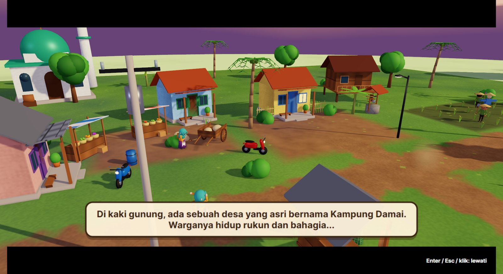 **1.** Kampung Damai yang asri, warganya hidup rukun | 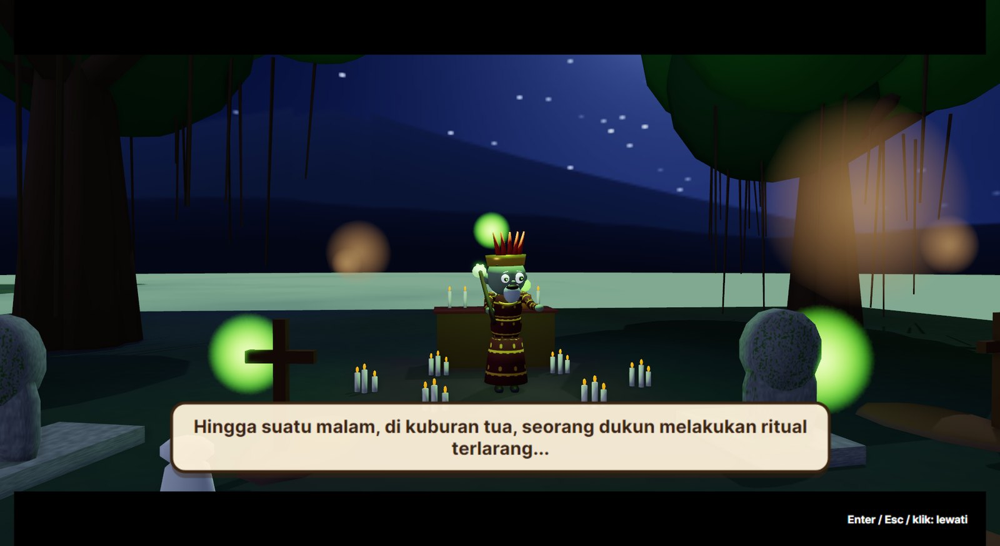 **2.** Malam di kuburan tua, Dukun melakukan ritual terlarang |
| 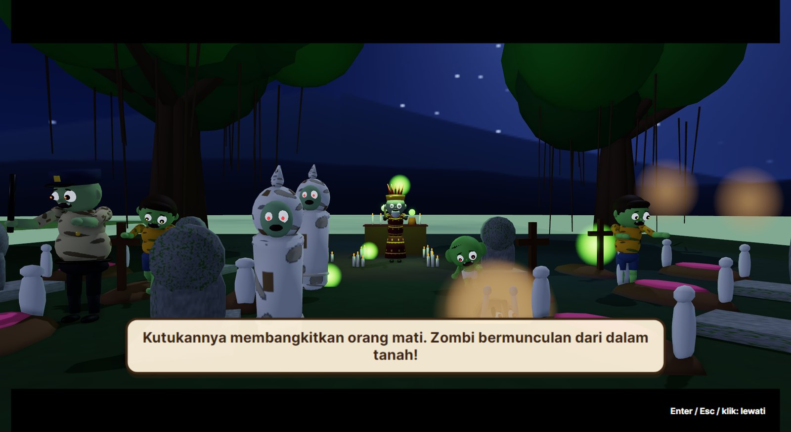 **3.** Zombi bangkit dari dalam tanah | 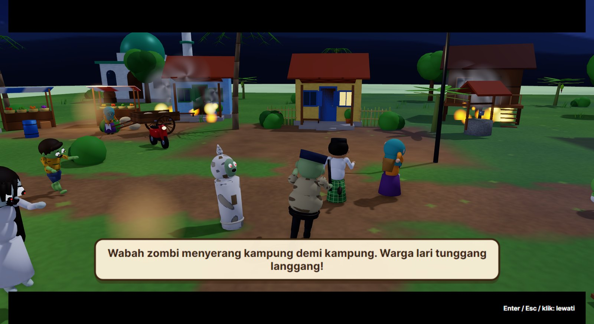 **4.** Wabah menyerang, warga lari tunggang langgang |
| 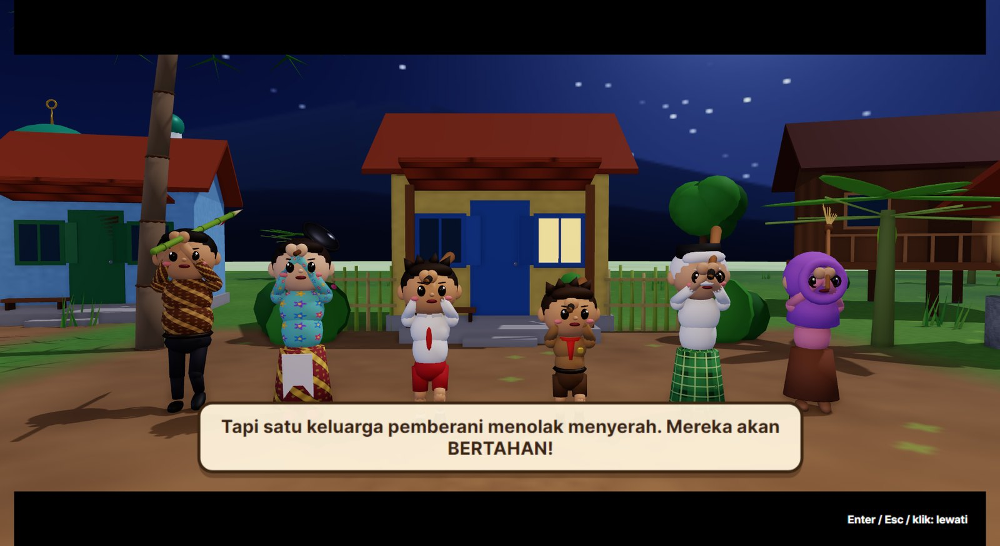 **5.** Satu keluarga pemberani menolak menyerah | 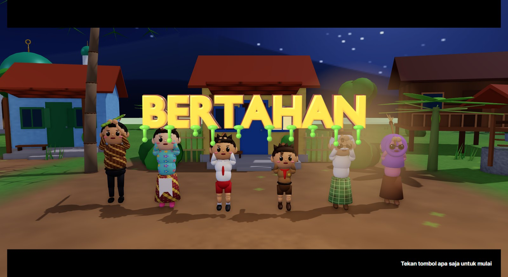 **6.** BERTAHAN! |

Teks cerita muncul seperti diketik mesin tik. Pergantian adegan memakai fade hitam, dan kilat menyambar di kuburan.

## Menu utama

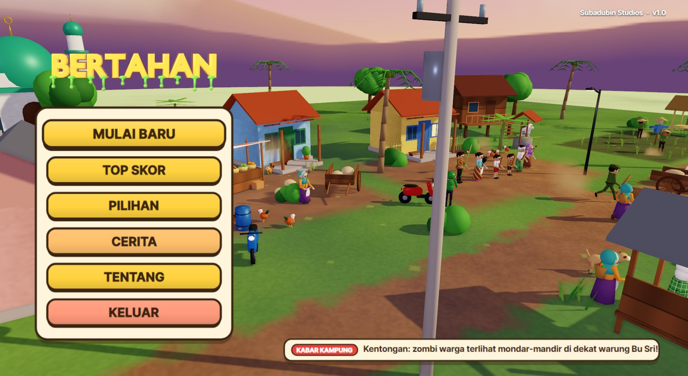

Latar menu adalah **desa 3D yang hidup**. Kamera berkeliling pelan dari satu sudut desa ke sudut lain:
- Bu pedagang menyapu di depan warung.
- Pak tani mencangkul sawah.
- Pak ustad dan tetangga mengobrol di pos ronda.
- Anak-anak berlarian main kejar-kejaran.
- Warga lain berjalan-jalan di jalan desa.

Setiap 9-15 detik, **zombi mondar-mandir** masuk desa (warga, tuyul, pocong, satpam, atau kuntilanak). Warga yang didekatinya menjerit dan lari, lalu kembali bekerja setelah zombi lewat. Papan **Kabar Kampung** di pojok kanan bawah menampilkan kabar lucu yang berganti-ganti.

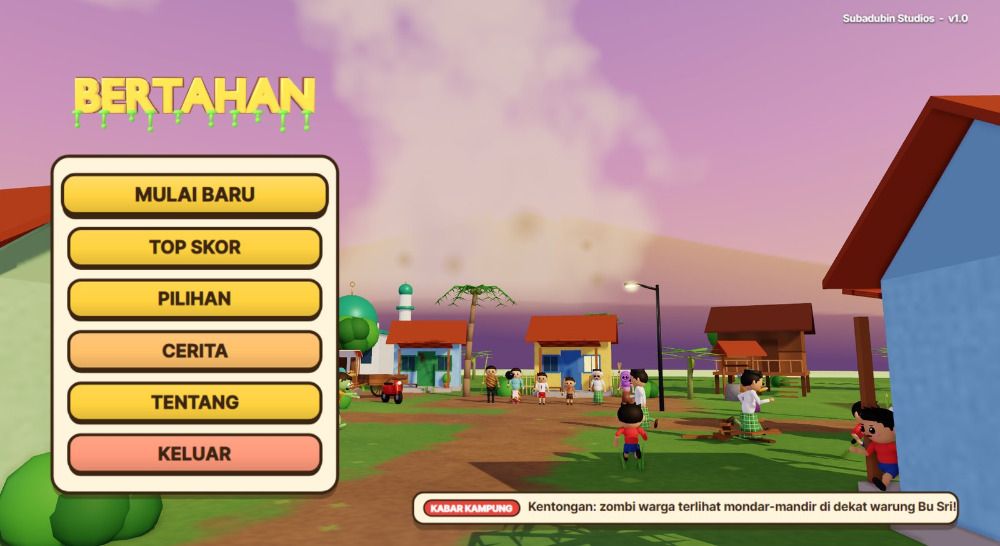

| Tombol | Fungsi |
|---|---|
| MULAI BARU | Memulai petualangan baru |
| LANJUTKAN | Muncul bila ada petualangan tersimpan; membuka Peta Petualangan |
| TOP SKOR | Papan skor tertinggi per level |
| PILIHAN | Suara, grafik, dan kontrol |
| CERITA | Memutar ulang cerita pembuka |
| TENTANG | Kredit bergulir |
| KELUAR | Keluar (dengan konfirmasi) |

## Alur New Game

**1. Nama.** Nama bawaan adalah **Si Otong**. Tersedia tombol *Nama Acak* (Si Unyil, Mas Bejo, Neng Geulis, dan lainnya) dan tombol *Si Otong* untuk kembali ke nama bawaan.

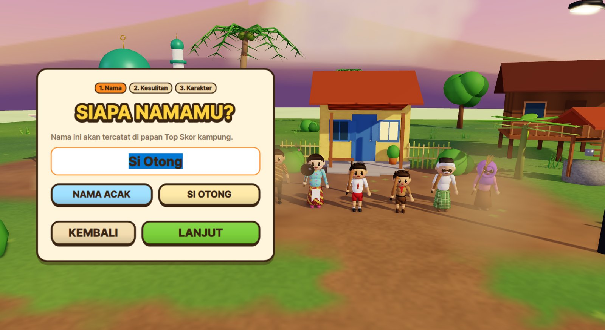

**2. Tingkat kesulitan.** Pilih Bayi, Pemberani, atau Mimpi Buruk. Tiap kartu menampilkan jumlah nyawa, kekuatan zombi, dan pengali skor.

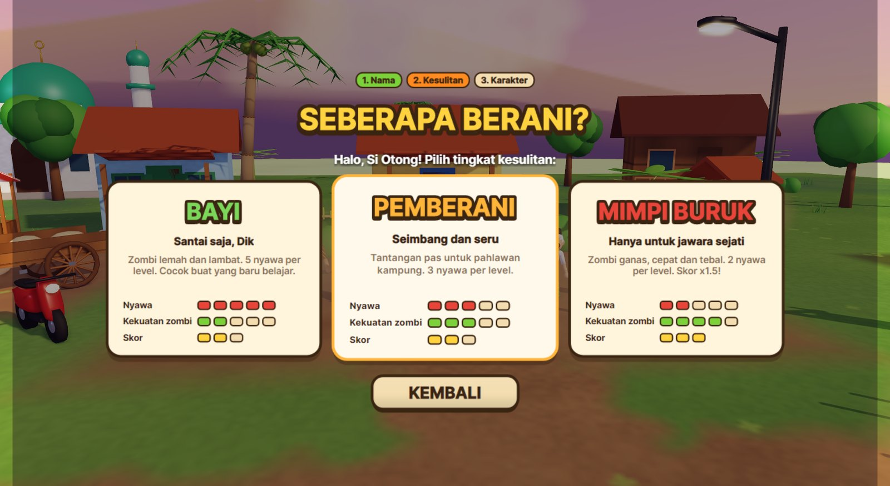

**3. Pilih karakter.** Anggota keluarga yang dipilih melangkah maju di latar 3D lalu bersorak (konfeti!). Panel menampilkan peran, keistimewaan, bilah statistik, dan senjata awal. Tekan **MULAI!** untuk langsung masuk ke Level 1.

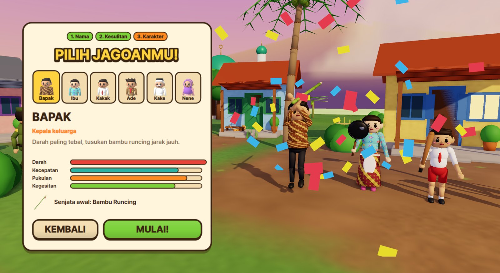

## Layar loading

Menampilkan gambar suasana level (dirender dari mesin game), nama dan zona level, deskripsi, serta tips acak.

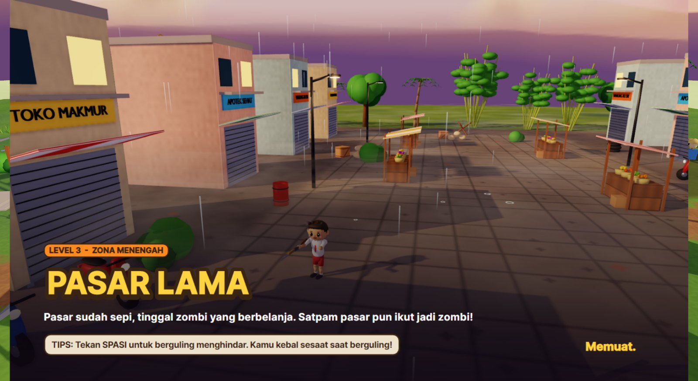

## HUD permainan

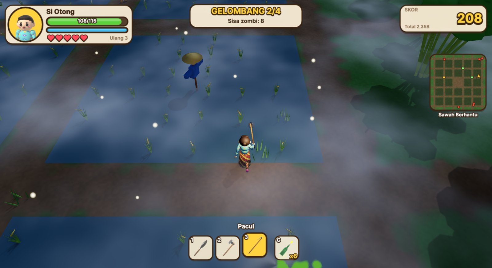

- **Kiri atas:** potret karakter, nama pemain, bilah darah (hijau, lalu kuning, lalu merah; berkedip saat kebal), bilah tenaga, hati untuk sisa nyawa, dan sisa kesempatan ulang.
- **Atas tengah:** nomor gelombang dan sisa zombi, atau hitung mundur ke gelombang berikutnya. Saat bos besar muncul, di bawahnya tampil **bilah darah bos**.
- **Kanan atas:** skor level dan skor total, serta **KOMBO** dengan pengali dan pengatur waktunya.
- **Minimap:** peta level dengan posisi pemain (panah kuning), zombi (merah), bos (ungu), dan barang (hijau/kuning).
- **Bawah tengah:** slot senjata bernomor, jumlah peluru senapan dan progres isi ulang, serta stok molotov.
- **Di dunia 3D:** angka damage yang melompat, bilah darah zombi yang terluka, dan bidikan di posisi mouse.
- **Efek layar:** vinyet merah saat terluka atau darah rendah, banner besar (nama level, gelombang, bos), dan pesan singkat (misalnya "Nasi bungkus! +35 darah").

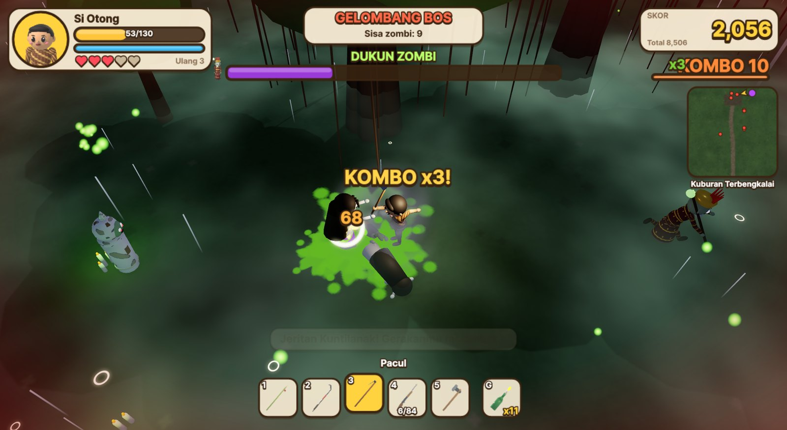

## Istirahat (pause)

Tekan Esc atau P. Pilihannya: Lanjutkan, Ulangi Level, Pilihan, Kontrol, dan Keluar ke Menu. Kemajuan tersimpan di awal level.

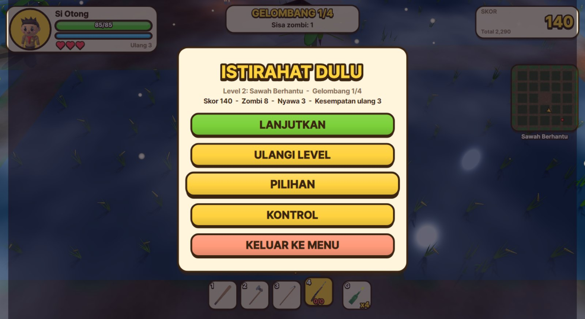

## Hasil level

**Menang: "KAMPUNG AMAN!"** Menampilkan 1-3 bintang dan rekap skor yang dihitung naik (zombi dikalahkan, kombo terbaik, bonus waktu, bonus darah, bonus nyawa, skor level, dan total). Ada juga peringkat Top Skor bila masuk 10 besar.

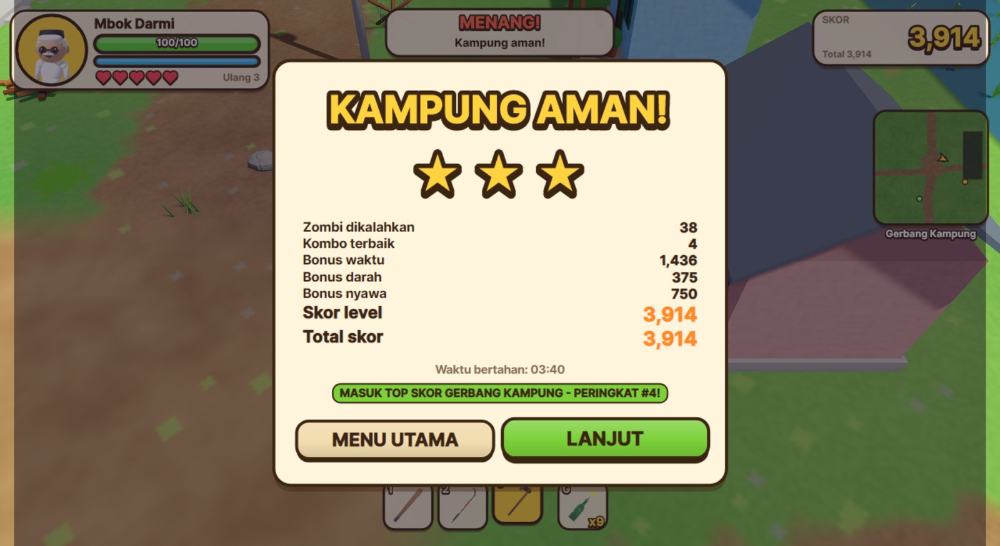

**Nyawa habis.** Level diulang. Layar menampilkan sisa kesempatan mengulang.

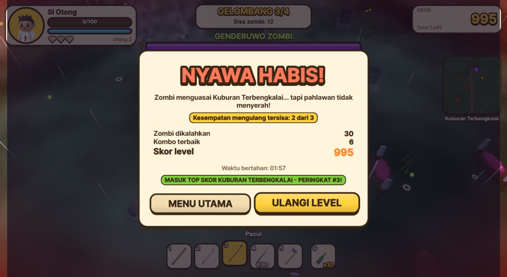

**Game Over.** Kesempatan mengulang habis, sehingga petualangan dimulai lagi dari Level 1.

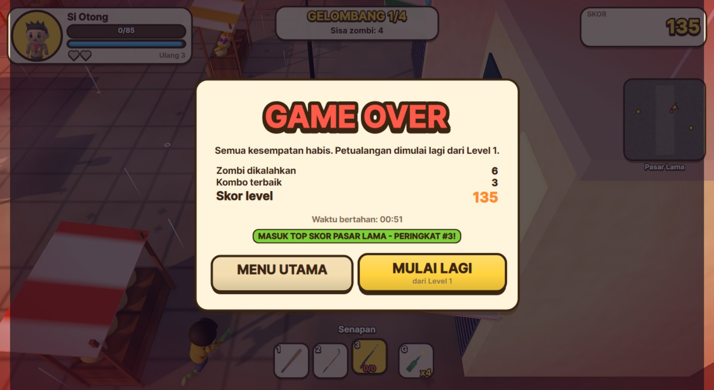

## Peta Petualangan

Muncul setelah menang dan saat memilih **LANJUTKAN**. Menampilkan info petualangan (nama, karakter, kesulitan, skor, dan kesempatan ulang), kartu level 1-4 (selesai, di sini, atau belum), dan level 5-10 berlabel **SEGERA HADIR**.

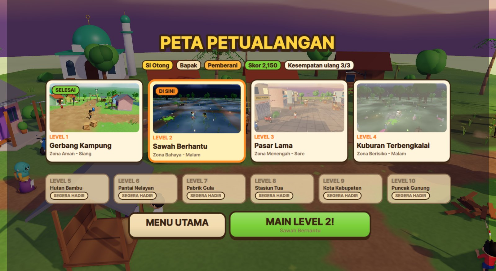

## Tamat

Setelah Dukun Zombi di Level 4 dikalahkan, muncul ucapan selamat, total skor, dan jumlah zombi yang dikalahkan, beserta pengumuman **Level 5-10 segera hadir**. Dari sini pemain bisa langsung menonton kredit.

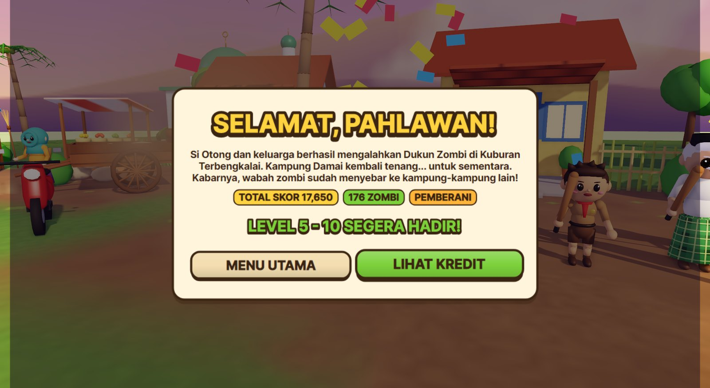

## Top Skor

Terdapat tab untuk Level 1-10 (Level 5-10 belum aktif). Setiap tab berisi 10 skor terbaik: peringkat dengan medali emas, perak, atau perunggu, potret karakter, nama pemain (bertanda "gugur" bila gagal), tingkat kesulitan, tanggal, dan skor.

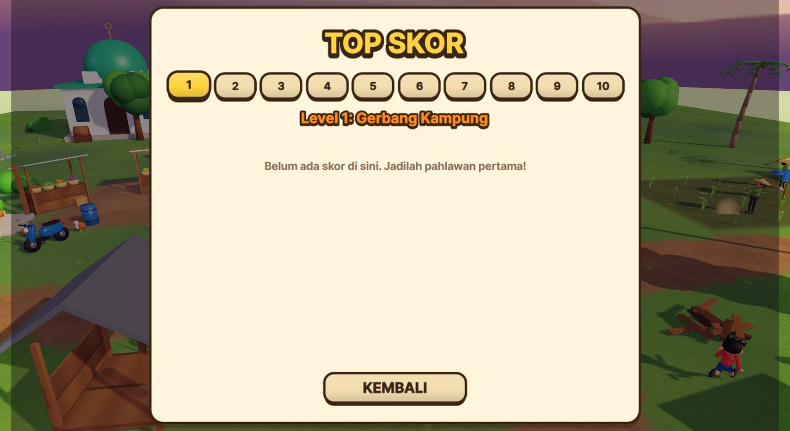

## Pilihan

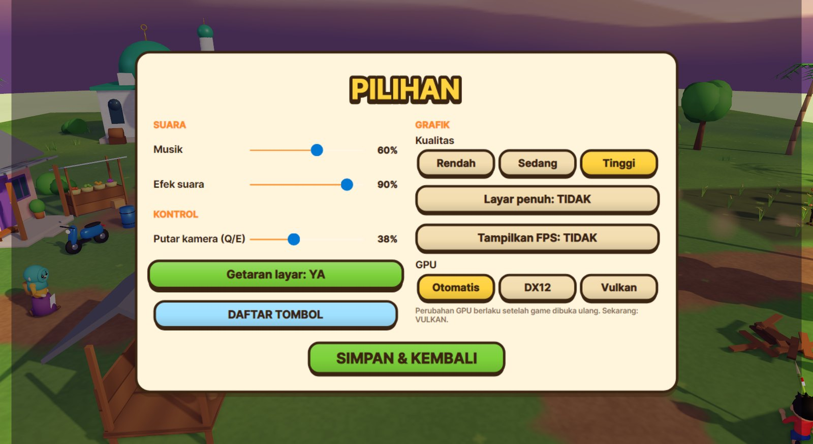

| Bagian | Pengaturan |
|---|---|
| Suara | Volume musik, volume efek suara |
| Kontrol | Kecepatan putar kamera (Q/E), getaran layar, daftar tombol |
| Grafik | Kualitas **Rendah / Sedang / Tinggi**, layar penuh, tampilkan FPS, GPU (**Otomatis / DX12 / Vulkan**) |

Rincian kualitas grafik:

| | Rendah | Sedang | Tinggi |
|---|---|---|---|
| Resolusi 3D | 70% | 100% | 100% |
| MSAA | 1x | 4x | 4x |
| Bayangan | 1024 px, 1 kaskade | 2048 px, 2 kaskade | 4096 px, 3 kaskade, lembut |
| Bloom | - | Ya | Ya |
| SSAO | - | - | Ya |

Perubahan GPU berlaku setelah game dibuka ulang. Pengaturan disimpan di `%APPDATA%/Bertahan/settings.json`.

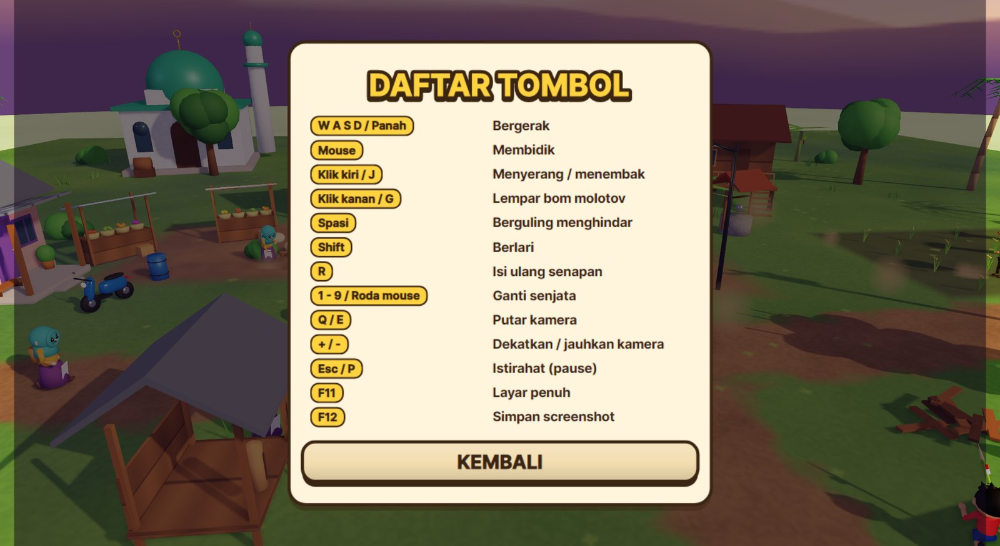

## Tentang

Kredit bergulir berisi logo, **"Dibuat oleh Ariana Mischa Fadhila dari Subadubin Studios"**, para pahlawan, para zombi, warga Kampung Damai, teknologi yang dipakai, dan ucapan terima kasih. Tekan panah atas/bawah untuk mengatur kecepatan gulir.

| | |
|---|---|
| 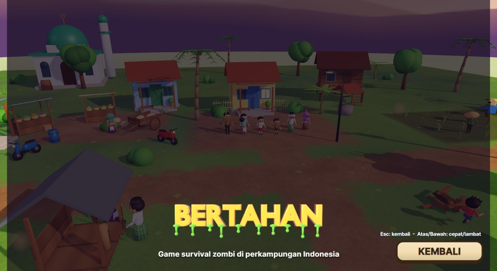 | 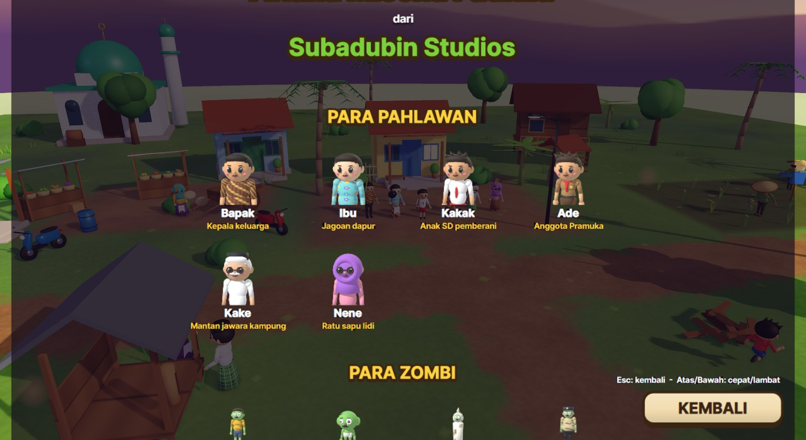 |
